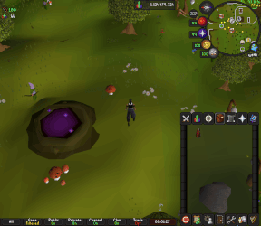

# Doom Unique Colors

Customize the color of the special-loot hole that appears after killing Doom of Mokhaiotl.

The shipped plugin hardcodes RuneLite's current `DOM_DESCEND_HOLE_UNIQUE` object ID, `50940`.
Players can change the color, but not the target object ID.

The recolor always targets the gold/yellow glow faces. This avoids turning the whole hole model
into one solid color.

## Settings

- **Unique hole color** - the color applied to the special-loot hole.
- **Recolor unique hole** - toggles the recolor on/off.

## Plugin Hub notes

This project follows RuneLite's external plugin template:

- Java 11 target
- `runelite-plugin.properties`
- `build=standard`
- no third-party dependencies beyond RuneLite template dependencies

## Local Development Tools

The shipped plugin is intentionally minimal. Local testing tools live in `dev-tools/full-version/`
and run through the separate `runDev` Gradle task. They are outside the main source set and are
not included in the artifact that players or the Plugin Hub get.
